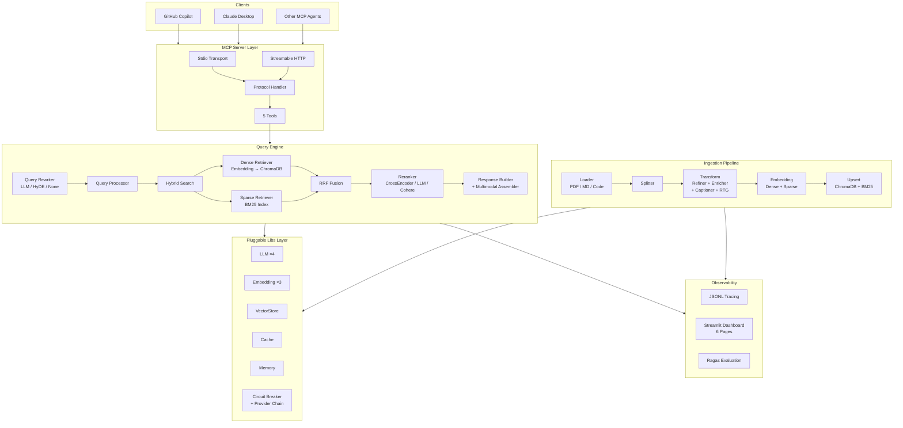
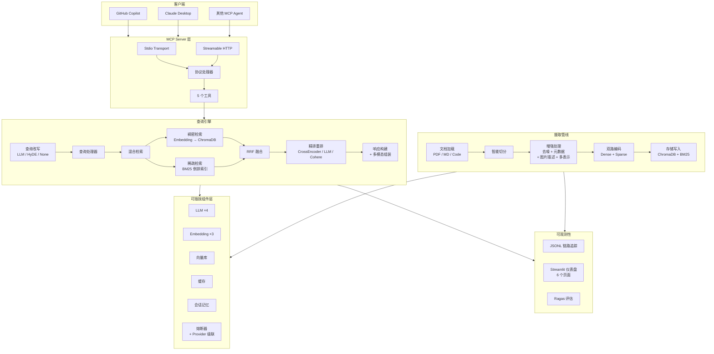

<div align="center">

# Modular RAG MCP Server

**[English](#-overview)** | **[中文](#-项目简介)**

[](https://python.org)
[](https://modelcontextprotocol.io)
[](tests/)
[](LICENSE)

A **fully modular** Retrieval-Augmented Generation system with **MCP protocol** integration.
Zero-code component switching. 4-layer API resilience. Dual-mode transport (Stdio + HTTP).

一个**全模块化** RAG 系统，集成 **MCP 协议**。
零代码组件切换，四层 API 容错，双模式传输（Stdio + HTTP）。

[Quick Start](#-quick-start) · [Architecture](#-architecture) · [Evaluation](#-evaluation) · [Roadmap](#-roadmap)

</div>

---

## 📖 Overview

A complete RAG pipeline — document ingestion, hybrid search, reranking, multimodal support — exposed as an [MCP](https://modelcontextprotocol.io) server. Connect it to GitHub Copilot, Claude Desktop, or any MCP-compatible AI assistant.

### Key Features

- **Hybrid Retrieval** — BM25 + Dense Embedding + RRF Fusion + Cross-Encoder / LLM Reranking
- **13 Pluggable Component Families** — LLM, Embedding, VectorStore, Reranker, Splitter, Evaluator, Cache, RateLimiter, QueryRewriter, QueryRouter, Memory, CircuitBreaker, Vision LLM — all swappable via `settings.yaml`
- **4-Layer Resilience** — Rate Limiter → Retry with Backoff → Circuit Breaker → Provider Failover (OpenAI → DeepSeek)
- **Dual Transport** — Stdio (local, zero-config) + Streamable HTTP (remote, Docker, multi-user)
- **5 MCP Tools** — `query_knowledge_hub`, `list_collections`, `get_document_summary`, `delete_document`, `ingest_document`
- **Multimodal** — PDF table extraction, formula OCR, Vision LLM image captioning, Base64 image return
- **Full Observability** — JSONL tracing across ingestion + query pipelines, 6-page Streamlit dashboard, Ragas evaluation
- **Multi-Representation Indexing** — LLM-generated natural language summaries for code chunks bridge the semantic gap between code and natural language queries

## 🏗 Architecture



### Design Patterns

| Pattern | Usage |
|:--------|:------|
| **Registry + Factory** | All component families — runtime provider registration |
| **Null Object** | NoneReranker, NoneEvaluator, NoneRewriter — no-op fallbacks |
| **Config-Driven** | `settings.yaml` → frozen dataclass → Factory.create_from_settings() |
| **Dual Storage** | ChromaDB (dense vectors) + independent BM25 index (sparse) |
| **4-Layer Resilience** | Rate Limiter → Retry → Circuit Breaker → Provider Failover |
| **Multi-Representation** | Code chunks: LLM summary for dense, raw code for BM25 |

### Resilience Stack

All LLM and Embedding API calls are protected by four composable layers:

```
ProviderChain (Layer 4 — Failover)
  └── CircuitBreaker (Layer 3 — Fast-fail after N failures)
        └── RateLimitedLLM (Layer 1 — Token bucket RPM control)
              └── @retry_with_backoff (Layer 2 — Exponential retry on 429/500/502/503)
                    └── HTTP API Call
```

## 🚀 Quick Start

### Prerequisites

- Python 3.10+
- LLM + Embedding provider: cloud API key (OpenAI / Azure / DeepSeek) or local [Ollama](https://ollama.ai)

### Setup

```bash
git clone https://github.com/nobitalqs/MODULAR-RAG-MCP-SERVER.git
cd MODULAR-RAG-MCP-SERVER
python -m venv .venv && source .venv/bin/activate
pip install -e ".[dev]"
cp config/settings.yaml.example config/settings.yaml   # edit for your provider
```

### Run

```bash
# Ingest documents
python scripts/ingest.py --path /path/to/doc.pdf --collection my_kb

# MCP Server — Stdio (for Copilot / Claude Desktop)
python main.py

# MCP Server — HTTP (for remote / Docker deployment)
python main.py --transport http --host 0.0.0.0 --port 8000

# Dashboard
python scripts/start_dashboard.py    # → http://localhost:8501
```

### Connect to MCP Host

<details>
<summary><b>GitHub Copilot / VS Code</b></summary>

Add to `.vscode/mcp.json`:
```json
{
  "mcpServers": {
    "modular-rag": {
      "command": "python",
      "args": ["main.py"],
      "cwd": "/path/to/MODULAR-RAG-MCP-SERVER"
    }
  }
}
```
</details>

<details>
<summary><b>Claude Desktop / Claude Code</b></summary>

```json
{
  "mcpServers": {
    "modular-rag": {
      "command": "python",
      "args": ["main.py"],
      "cwd": "/path/to/MODULAR-RAG-MCP-SERVER"
    }
  }
}
```
</details>

<details>
<summary><b>HTTP mode (remote)</b></summary>

Start server: `python main.py --transport http --host 0.0.0.0 --port 8000`

Connect via MCP Streamable HTTP client to `http://<host>:8000/mcp`
</details>

## 📊 Evaluation

### Ragas Evaluation Framework

The project integrates [Ragas](https://docs.ragas.io/) for automated RAG quality assessment using LLM-as-Judge:

| Metric | What It Measures |
|:-------|:-----------------|
| **Faithfulness** | Is the answer grounded in the retrieved context? (anti-hallucination) |
| **Answer Relevancy** | Does the answer actually address the question? |
| **Context Precision** | Are the retrieved chunks relevant and well-ranked? |

### Benchmark Results

Evaluated on a golden test set of **16 queries across 4 categories** (3 documents, 440 chunks):

| Metric | Score | What It Means |
|:-------|:-----:|:--------------|
| **Faithfulness** | 0.82 | Answers are well-grounded in retrieved context |
| **Context Precision** | 0.74 | Retrieved chunks are relevant and well-ranked |
| **Answer Relevancy** | 0.61 | Answers address the question (room for improvement) |

Run your own evaluation:

```bash
python scripts/evaluate.py --collection golden --top-k 5
```

### Test Suite

| Type | Count |
|:-----|------:|
| Unit | 1798 |
| Integration | 70 |
| **Total** | **1868** |

## 🔌 Pluggable Components

| Component | Providers | Config Key |
|:----------|:----------|:-----------|
| LLM | `openai`, `azure`, `ollama`, `deepseek` | `llm.provider` |
| Embedding | `openai`, `azure`, `ollama` | `embedding.provider` |
| Vision LLM | `openai`, `azure` | `vision_llm.provider` |
| Reranker | `cross_encoder`, `llm`, `cohere`, `none` | `rerank.provider` |
| VectorStore | `chroma` | `vector_store.provider` |
| Evaluator | `ragas`, `custom` | `evaluation.provider` |
| Cache | `memory`, `redis` | `cache.provider` |
| Rate Limiter | `token_bucket`, `null` | `rate_limit.provider` |
| Query Rewriter | `llm`, `hyde`, `none` | `query_rewriting.provider` |
| Memory | `memory`, `redis` | `memory.provider` |

> **Adding a new provider:** inherit the base class, implement the interface, register with the factory. Zero modification to existing code.

## 📺 Dashboard

6-page Streamlit management platform:

| Page | Capabilities |
|:-----|:-------------|
| **Overview** | Component config, collection stats, system health |
| **Data Browser** | Browse chunks, metadata, image preview |
| **Ingestion Manager** | Upload, ingest, delete documents with progress tracking |
| **Ingestion Traces** | Stage-by-stage waterfall: load → split → transform → embed → upsert |
| **Query Traces** | Pipeline trace: rewrite → dense/sparse → fusion → rerank |
| **Evaluation Panel** | Run evaluations, view metrics, historical trends |

## 🗺 Roadmap

### Multi-User & Distributed

| Priority | Item | Description |
|:--------:|:-----|:------------|
| 1 | Auth middleware | API Key / OAuth2 on HTTP transport |
| 2 | Multi-tenant isolation | Collection-level tenant separation |
| 3 | Redis state externalization | Cache, Memory, RateLimiter → Redis (code ready, config switch) |
| 4 | BM25 shared storage | Pickle → Redis / Elasticsearch |
| 5 | Distributed vector store | ChromaDB → Milvus / Qdrant |
| 6 | Docker containerization | Dockerfile + docker-compose |

### Advanced RAG

| Item | Description |
|:-----|:------------|
| Agentic RAG | Atomic tools (list_directory, verify_fact) for multi-step agent reasoning |
| Hierarchical Retrieval | Document-level summary → chunk-level search for large corpora |
| Multi-representation expansion | Extend LLM summaries from code to tables and formulas |
| Domain-specific embedding | Different embedding models per doc_type |

## 📂 Project Structure

```
src/
├── core/              # Settings, types, query engine, response builder, tracing
├── libs/              # 13 pluggable component families (Factory + Base + Providers)
│   ├── llm/           # 4 LLM + 2 Vision LLM providers
│   ├── embedding/     # 3 providers + EmbeddingChain failover
│   ├── reranker/      # CrossEncoder / LLM / Cohere / None
│   ├── resilience/    # RetryWithBackoff, RateLimitedLLM
│   ├── circuit_breaker/  # CircuitBreaker, ProviderChain, EmbeddingChain
│   └── ...            # cache, memory, query_rewriter, query_router, etc.
├── ingestion/         # 6-stage pipeline: load → split → transform → embed → upsert
├── mcp_server/        # Protocol handler + 5 MCP tools
└── observability/     # Logger, tracing, dashboard (6 pages), evaluation (Ragas)
```

## ❓ FAQ

<details>
<summary><b>Can I run fully offline?</b></summary>

Yes. Install [Ollama](https://ollama.ai), set all providers to `ollama`, and run with zero API costs:
```bash
ollama pull qwen2.5:3b && ollama pull nomic-embed-text
```
</details>

<details>
<summary><b>ChromaDB dimension mismatch?</b></summary>

Happens when switching embedding providers (e.g., OpenAI 1536-dim → Ollama 768-dim). Delete the old collection and re-ingest.
</details>

<details>
<summary><b>How to add a new LLM provider?</b></summary>

1. Inherit `BaseLLM`, implement `chat()`
2. Register: `factory.register_provider("my_provider", MyLLM)`
3. Set `llm.provider: "my_provider"` in settings.yaml
</details>

## 📄 License

MIT

---

## 📖 项目简介

一个完整的 RAG 流水线系统 — 文档摄取、混合检索、精排重排、多模态支持 — 通过 [MCP 协议](https://modelcontextprotocol.io) 对外暴露，可直接对接 GitHub Copilot、Claude Desktop 等 AI 助手。

### 核心特性

- **混合检索** — BM25 稀疏 + 稠密向量检索，RRF 融合，Cross-Encoder / LLM 精排
- **13 大可插拔组件族** — 全部通过 `settings.yaml` 零代码切换
- **四层 API 容错** — 限流 → 指数退避重试 → 熔断器 → Provider 自动降级（OpenAI → DeepSeek）
- **双模式传输** — Stdio（本地零配置）+ Streamable HTTP（远程部署/Docker/多用户）
- **5 个 MCP 工具** — 知识检索、集合列表、文档摘要、文档删除、远程摄入
- **多模态** — PDF 表格提取、公式 OCR、Vision LLM 图片描述、Base64 图片返回
- **全链路可观测** — JSONL 追踪 + 6 页 Streamlit 仪表盘 + Ragas 评估
- **多表示索引** — 代码块自动生成自然语言摘要用于语义检索，原始代码用于关键词检索

## 🏗 系统架构



### 四层容错体系

所有 LLM / Embedding API 调用均受四层保护：

```
ProviderChain（Layer 4 — Provider 降级：OpenAI → DeepSeek）
  └── CircuitBreaker（Layer 3 — 连续失败后快速熔断）
        └── RateLimitedLLM（Layer 1 — 令牌桶限速）
              └── @retry_with_backoff（Layer 2 — 429/500/502/503 指数退避重试）
                    └── HTTP API 调用
```

### 设计模式

| 模式 | 应用 |
|:-----|:-----|
| **Registry + Factory** | 全部组件族 — 运行时注册，零工厂修改 |
| **Null Object** | NoneReranker / NoneEvaluator / NoneRewriter — 禁用时的无操作回退 |
| **配置驱动** | `settings.yaml` → frozen dataclass → Factory.create_from_settings() |
| **双存储** | ChromaDB（稠密向量）+ 独立 BM25 索引（稀疏关键词） |
| **多表示索引** | 代码块：LLM 摘要用于 Dense，原始代码用于 BM25 |

## 🚀 快速开始

### 环境要求

- Python 3.10+
- LLM + Embedding 后端：云 API（OpenAI / Azure / DeepSeek）或本地 [Ollama](https://ollama.ai)

### 安装

```bash
git clone https://github.com/nobitalqs/MODULAR-RAG-MCP-SERVER.git
cd MODULAR-RAG-MCP-SERVER
python -m venv .venv && source .venv/bin/activate
pip install -e ".[dev]"
cp config/settings.yaml.example config/settings.yaml   # 按需修改
```

### 运行

```bash
# 摄取文档
python scripts/ingest.py --path /path/to/doc.pdf --collection my_kb

# 启动 MCP 服务器
python main.py                                    # Stdio（默认，本地开发）
python main.py --transport http --port 8000       # HTTP（远程/Docker）

# 启动仪表盘
python scripts/start_dashboard.py                 # → http://localhost:8501
```

### 对接 MCP 客户端

<details>
<summary><b>GitHub Copilot / VS Code</b></summary>

添加到 `.vscode/mcp.json`：
```json
{
  "mcpServers": {
    "modular-rag": {
      "command": "python",
      "args": ["main.py"],
      "cwd": "/path/to/MODULAR-RAG-MCP-SERVER"
    }
  }
}
```
</details>

<details>
<summary><b>Claude Desktop / Claude Code</b></summary>

```json
{
  "mcpServers": {
    "modular-rag": {
      "command": "python",
      "args": ["main.py"],
      "cwd": "/path/to/MODULAR-RAG-MCP-SERVER"
    }
  }
}
```
</details>

<details>
<summary><b>HTTP 模式（远程部署）</b></summary>

启动服务：`python main.py --transport http --host 0.0.0.0 --port 8000`

客户端通过 MCP Streamable HTTP 连接 `http://<host>:8000/mcp`
</details>

## 📊 评估体系

集成 [Ragas](https://docs.ragas.io/) 框架，基于 LLM-as-Judge 进行自动化 RAG 质量评估：

| 指标 | 评估内容 |
|:-----|:---------|
| **Faithfulness** | 答案是否基于检索到的上下文？（反幻觉） |
| **Answer Relevancy** | 答案是否真正回答了问题？ |
| **Context Precision** | 检索到的文档是否相关且排序合理？ |

### 评估基线

基于 **16 条查询、4 个类别** 的黄金测试集（3 份文档，440 chunks）：

| 指标 | 分数 | 含义 |
|:-----|:----:|:-----|
| **Faithfulness** | 0.82 | 答案忠实于检索到的上下文 |
| **Context Precision** | 0.74 | 检索到的文档相关且排序合理 |
| **Answer Relevancy** | 0.61 | 答案与问题的相关性（有提升空间） |

运行评估：

```bash
python scripts/evaluate.py --collection golden --top-k 5
```

### 测试覆盖

| 类型 | 数量 |
|:-----|-----:|
| 单元测试 | 1798 |
| 集成测试 | 70 |
| **合计** | **1868** |

## 🔌 可插拔组件

| 组件 | 可选后端 | 配置项 |
|:-----|:---------|:-------|
| LLM | `openai`, `azure`, `ollama`, `deepseek` | `llm.provider` |
| Embedding | `openai`, `azure`, `ollama` | `embedding.provider` |
| Vision LLM | `openai`, `azure` | `vision_llm.provider` |
| Reranker | `cross_encoder`, `llm`, `cohere`, `none` | `rerank.provider` |
| 评估器 | `ragas`, `custom` | `evaluation.provider` |
| 缓存 | `memory`, `redis` | `cache.provider` |
| 限流器 | `token_bucket`, `null` | `rate_limit.provider` |
| 查询改写 | `llm`, `hyde`, `none` | `query_rewriting.provider` |
| 会话记忆 | `memory`, `redis` | `memory.provider` |

> 新增后端 = 继承基类 + 实现接口 + 注册到 Factory，不改现有代码。

## 📺 仪表盘

6 页 Streamlit 可视化管理平台：

| 页面 | 功能 |
|:-----|:-----|
| **系统总览** | 组件配置、集合统计、系统健康 |
| **数据浏览器** | Chunk 内容、元数据、图片预览 |
| **摄取管理** | 上传文档、触发摄取、删除文档，实时进度 |
| **摄取追踪** | 阶段耗时瀑布图：load → split → transform → embed → upsert |
| **查询追踪** | 管线追踪：rewrite → dense/sparse → fusion → rerank |
| **评估面板** | 运行 Ragas 评估、查看指标、历史趋势 |

## 🗺 扩展方向

### 多用户与分布式

| 优先级 | 项目 | 说明 |
|:------:|:-----|:-----|
| 1 | 认证中间件 | HTTP Transport 上加 API Key / OAuth2 |
| 2 | 多租户隔离 | Collection 级别按 tenant_id 隔离 |
| 3 | Redis 状态外置 | 缓存、记忆、限流 → Redis（代码已就绪，仅需改配置） |
| 4 | BM25 共享存储 | Pickle → Redis / Elasticsearch |
| 5 | 分布式向量库 | ChromaDB → Milvus / Qdrant |
| 6 | Docker 容器化 | Dockerfile + docker-compose |

### 高级 RAG

| 项目 | 说明 |
|:-----|:-----|
| Agentic RAG | 原子化工具（list_directory, verify_fact），支持多步 Agent 推理 |
| 分层检索 | 文档级摘要 → chunk 级精搜，适用于大规模语料 |
| 多表示扩展 | LLM 摘要从代码扩展到表格、公式 |
| 领域专用 Embedding | 不同 doc_type 使用不同 Embedding 模型 |

## 📂 项目结构

```
src/
├── core/              # 配置、类型、查询引擎、响应构建、链路追踪
├── libs/              # 13 大可插拔组件族（Factory + Base + Providers）
│   ├── llm/           # 4 个 LLM + 2 个 Vision LLM Provider
│   ├── embedding/     # 3 个 Provider + EmbeddingChain 容错
│   ├── reranker/      # CrossEncoder / LLM / Cohere / None
│   ├── resilience/    # RetryWithBackoff, RateLimitedLLM
│   ├── circuit_breaker/  # 熔断器、ProviderChain、EmbeddingChain
│   └── ...            # cache, memory, query_rewriter, query_router 等
├── ingestion/         # 6 阶段管线：load → split → transform → embed → upsert
├── mcp_server/        # 协议处理器 + 5 个 MCP 工具
└── observability/     # 日志、追踪、仪表盘（6 页）、评估（Ragas）
```

## ❓ 常见问题

<details>
<summary><b>能完全离线运行吗？</b></summary>

可以。安装 [Ollama](https://ollama.ai)，将所有 provider 设为 `ollama`，零 API 费用运行：
```bash
ollama pull qwen2.5:3b && ollama pull nomic-embed-text
```
</details>

<details>
<summary><b>ChromaDB 维度不匹配？</b></summary>

切换 Embedding Provider 时会出现（如 OpenAI 1536 维 → Ollama 768 维）。删除旧 collection 后重新摄取即可。
</details>

<details>
<summary><b>如何新增 LLM Provider？</b></summary>

1. 继承 `BaseLLM`，实现 `chat()` 方法
2. 注册：`factory.register_provider("my_provider", MyLLM)`
3. 配置：`llm.provider: "my_provider"`
</details>

## 📄 License

MIT
